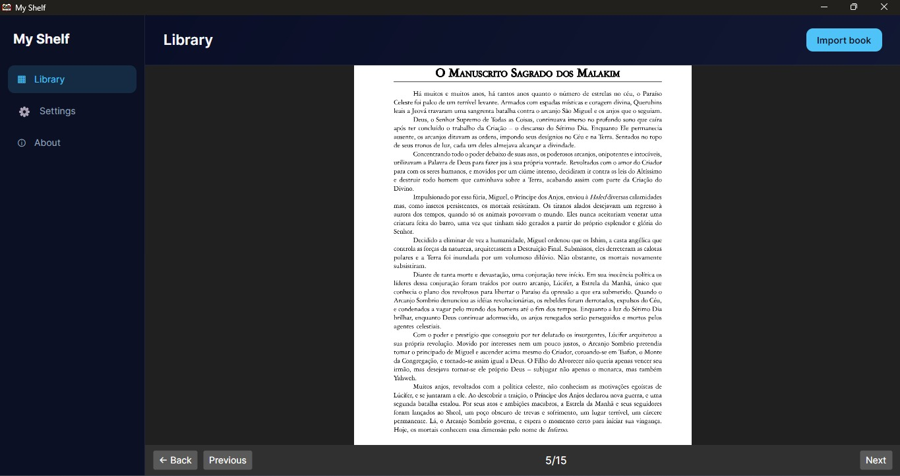
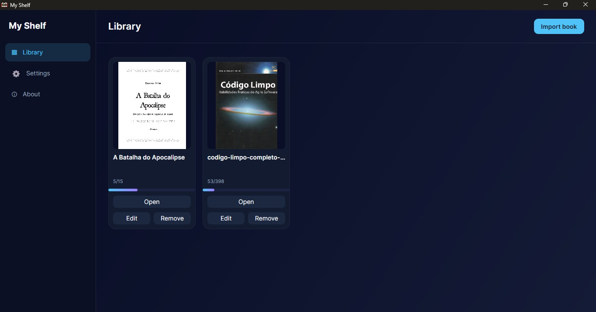

# 📚 Minha Estante

<p align="center">
  <a href="#english">🇺🇸 English</a> | <a href="#português">🇧🇷 Português</a>
</p>

---

<a id="english"></a>
## English

### About

Minha Estante is a cross-platform desktop application for organizing and reading digital books, manga, and comics. It provides a visual bookshelf where you can import your PDF and CBZ files, browse them by cover, and pick up reading right where you left off.

### Purpose

This project was built to explore clean, maintainable desktop application architecture in .NET while solving a real personal need: a single, lightweight place to keep and read PDFs, manga, and comic files without depending on cloud services or heavy third-party readers.

### Interface

<p align="center">
  
  
</p>

### Features

- Import and organize PDF and CBZ files in a visual library grid
- Built-in reader with zoom, page navigation, and reading progress tracking
- Dark, modern dashboard-style interface
- Configurable reading and appearance preferences
- Fully offline, local-first — your files and data never leave your machine

### Tech Stack

- C# 12 / .NET 8
- Avalonia UI (MVVM, CommunityToolkit.Mvvm)
- Entity Framework Core + SQLite
- PDFtoImage (PDFium) for PDF rendering
- xUnit for unit testing

### Architecture

The project follows Clean Architecture principles, with dependencies always pointing inward:

```
MinhaEstante.Domain          -> core entities and business rules
MinhaEstante.Application     -> use cases and interfaces
MinhaEstante.Infrastructure  -> EF Core/SQLite, file storage, PDF rendering
MinhaEstante.Presentation    -> Avalonia UI (Views, ViewModels)
```

SOLID principles and dependency injection are applied throughout, keeping the domain layer fully independent from frameworks and external libraries.

### Download

Grab the latest installer from the [Releases page](https://github.com/LucasPet-dev/Biblioteca-Library-Minha-Estante-/releases):
- **Windows:** `MinhaEstanteSetup.exe`
- **Linux:** ⚠️ *support is still being developed and tested — a downloadable AppImage will be published in a future release*

### Build from Source

```bash
git clone https://github.com/LucasPet-dev/Biblioteca-Library-Minha-Estante-.git
cd Biblioteca-Library-Minha-Estante-
dotnet restore
dotnet run --project src/MinhaEstante.Presentation
```

### License

This project is licensed under the MIT License — see the [LICENSE](LICENSE) file for details.

---

<a id="português"></a>
## Português

### Sobre

Minha Estante é uma aplicação desktop multiplataforma para organizar e ler livros digitais, mangás e HQs. Oferece uma estante visual onde você pode importar seus arquivos PDF e CBZ, navegar por capa e continuar a leitura de onde parou.

### Finalidade

Este projeto foi construído para explorar uma arquitetura de aplicação desktop limpa e sustentável em .NET, ao mesmo tempo resolvendo uma necessidade pessoal real: um lugar único e leve para guardar e ler PDFs, mangás e HQs, sem depender de serviços em nuvem ou leitores pesados de terceiros.

### Interface

<p align="center">
  
  
</p>

### Funcionalidades

- Importação e organização de arquivos PDF e CBZ numa grade visual de biblioteca
- Leitor embutido com zoom, navegação de páginas e controle de progresso de leitura
- Interface moderna em estilo dashboard, tema escuro
- Preferências configuráveis de leitura e aparência
- Totalmente offline, local-first — seus arquivos e dados nunca saem da sua máquina

### Tecnologias

- C# 12 / .NET 8
- Avalonia UI (MVVM, CommunityToolkit.Mvvm)
- Entity Framework Core + SQLite
- PDFtoImage (PDFium) para renderização de PDF
- xUnit para testes unitários

### Arquitetura

O projeto segue os princípios de Clean Architecture, com as dependências sempre apontando para dentro:

```
MinhaEstante.Domain          -> entidades e regras de negócio
MinhaEstante.Application     -> casos de uso e interfaces
MinhaEstante.Infrastructure  -> EF Core/SQLite, armazenamento de arquivos, renderização de PDF
MinhaEstante.Presentation    -> Avalonia UI (Views, ViewModels)
```

Princípios SOLID e injeção de dependência são aplicados em todo o projeto, mantendo a camada de domínio totalmente independente de frameworks e bibliotecas externas.

### Download

Baixe o instalador mais recente na [página de Releases](https://github.com/LucasPet-dev/Biblioteca-Library-Minha-Estante-/releases):
- **Windows:** `MinhaEstanteSetup.exe`
- **Linux:** ⚠️ *suporte ainda em desenvolvimento e testes — um AppImage para download será publicado em uma versão futura*

### Buildar a partir do código-fonte

```bash
git clone https://github.com/LucasPet-dev/Biblioteca-Library-Minha-Estante-.git
cd Biblioteca-Library-Minha-Estante-
dotnet restore
dotnet run --project src/MinhaEstante.Presentation
```

### Licença

Este projeto está licenciado sob a Licença MIT — veja o arquivo [LICENSE](LICENSE) para mais detalhes.